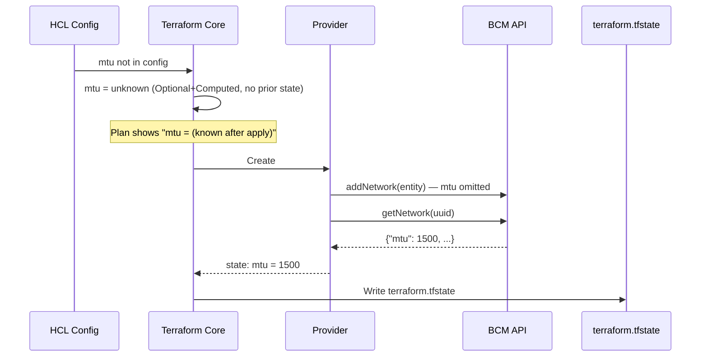
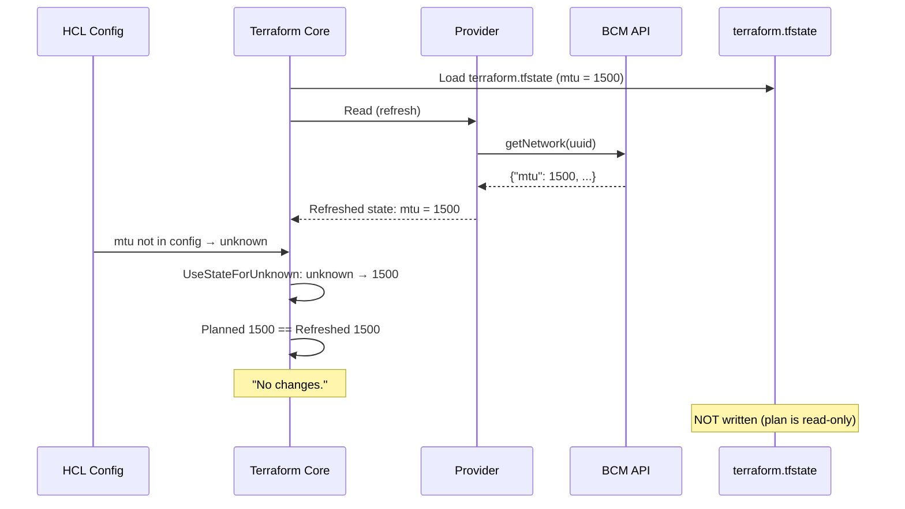
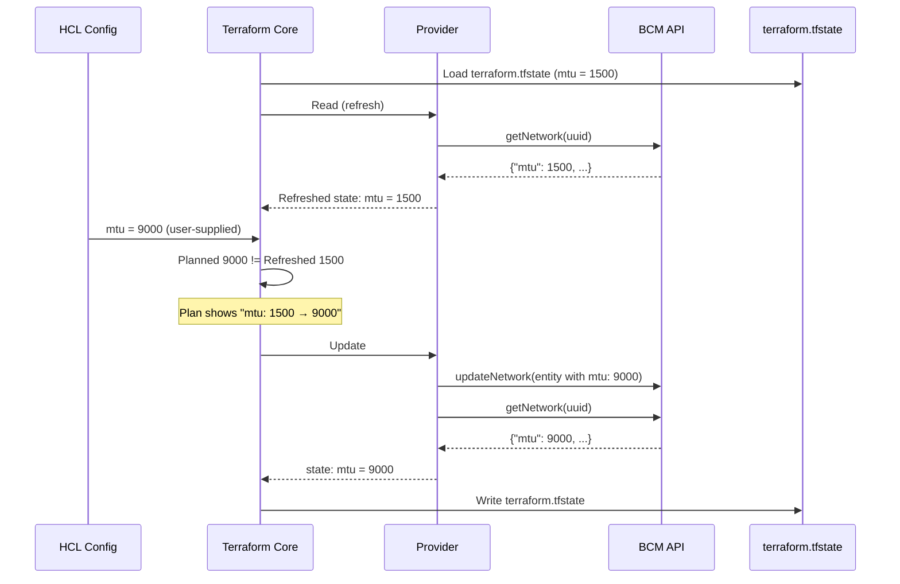
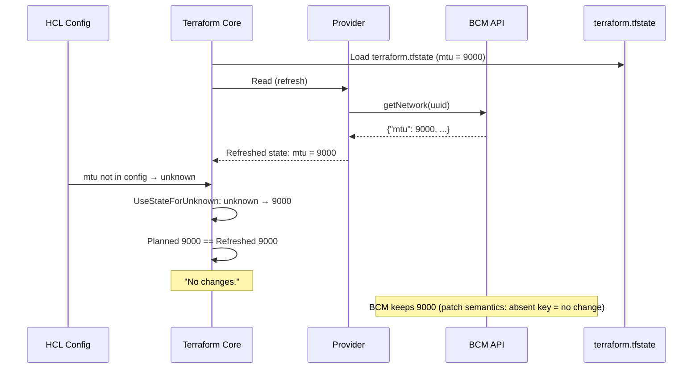
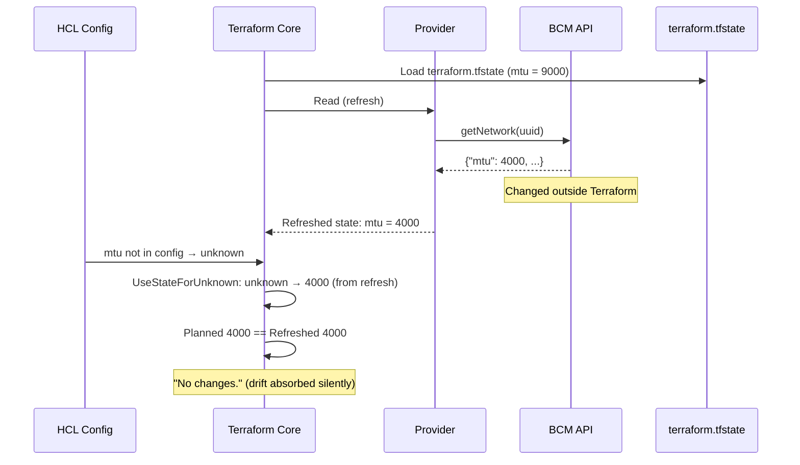

# How Terraform Resolves State from Plan and Read

## Schema Attribute Modes

Every attribute in a Terraform provider schema has flags that control who can set it and when:

| Schema | User sets value | User omits value |
|---|---|---|
| `Required` | Uses user value | Error |
| `Optional` | Uses user value | `null` in plan and state |
| `Computed` | Error — user can't set it | Provider fills it in |
| `Optional+Computed` | Uses user value | Provider fills it in |

**Optional+Computed** is the workhorse for API-driven fields: the user *can* set a value, but if they don't, the provider populates it from the API response. This is the right choice for any field where the remote system has a default.

### UseStateForUnknown

When Terraform plans an `Optional+Computed` field the user didn't set, the value is `unknown` — Terraform doesn't know what it will be until apply. Without intervention, every plan would show `mtu = (known after apply)` even when nothing changed.

The `UseStateForUnknown()` plan modifier fixes this: during planning, if the value is `unknown` and prior state exists, it substitutes the state value. This eliminates noisy diffs on stable resources.

## Four Representations of a Resource

A single resource exists in four different forms, each serving a different purpose:

| Representation | Purpose | Content | Example (globalnet) |
|---|---|---|---|
| **HCL config** | User intent — "what I want" | Only fields the user cares about | 3 fields: `name`, `network_type`, `domain_name` |
| **terraform.tfstate** | Last-known truth — "what the remote system had at last refresh" | Every attribute in the schema | All ~30 fields: `mtu`, `bootable`, `allow_autosign`, etc. |
| **Live BCM state** | Ground truth — "what BCM actually has right now" | The real values in the BCM database | May differ from state if someone changed BCM directly |
| **API payload** | Delta — "what to change" | Required fields and fields being set | Varies per operation |

**State and live BCM can diverge.** The state file is a snapshot written at the end of the last `terraform apply`. Between applies, anyone (or anything) can modify BCM directly — through the BCM UI, the REST API, or BCM-internal processes like category inheritance. For example, if state records `mtu = 9000` but an admin changes it to `4000` in BCM, the state file is stale until Terraform runs again.

**Refresh is the bridge.** Every `terraform plan` and `terraform apply` begins with a refresh phase: the provider calls `Read()` against the live BCM API for each resource and updates the in-memory state to match BCM reality. By the time Terraform computes a diff, state has been reconciled with the live system. If the user omits `mtu` from HCL and BCM now has `4000`, `UseStateForUnknown` picks up the refreshed value — Terraform silently absorbs the drift and shows "No changes." The state file on disk is only updated if `apply` runs.

**State is always full.** Even if the HCL only sets 3 fields, the state file stores every attribute — populated by the provider's Read method calling the BCM API and mapping the complete response. This is how Terraform detects drift: it compares the full state against both the config and the next API read.

**The API payload is always minimal.** The `Set*Field` helpers omit null/sentinel fields from the entity sent to BCM. On create, this lets BCM apply its own defaults. On update, this means only changed fields are sent — BCM keeps existing values for omitted keys (patch semantics).

**`Optional+Computed` with `UseStateForUnknown` ties it together.** When the user omits a field:

1. BCM applies its default (e.g. `mtu = 1500`) on create
2. The provider reads back the full entity and stores `mtu = 1500` in state
3. On next plan, `UseStateForUnknown` fills the plan with `1500` from state
4. Plan matches state — no diff, no update payload sent
5. BCM keeps `1500` untouched

The user wrote nothing about `mtu`, but state accurately reflects `1500`, and BCM is never asked to change it. All four representations stay in sync through different mechanisms: HCL through user intent, state through API reads (refresh), live BCM through its own storage, and payloads through delta computation. The refresh phase is what keeps state aligned with live BCM — without it, state would go stale the moment anything touches BCM outside of Terraform.

## The Lifecycle: What Happens When

### terraform plan

```
1. LOAD        Read terraform.tfstate from disk into memory.
2. REFRESH     For each resource in state, call provider Read().
               → Provider calls BCM API (e.g. getNetwork(uuid))
               → BCM returns current field values
               → Provider writes these into the in-memory state object
               ⚠ State file on disk is NOT updated.
3. PLAN        For each resource in config, compute the "planned value":
               → Merge HCL config with refreshed in-memory state
               → For Optional+Computed fields user didn't set: value = unknown
               → UseStateForUnknown fires: replaces unknown with refreshed state value
4. DIFF        Compare planned values against refreshed state.
               → Differences become the plan output shown to the user.
               → If planned == refreshed for all fields: "No changes."
```

State file on disk: **unchanged**. `terraform plan` is read-only.

### Where does the plan live?

The plan is computed in-memory and **not saved to disk by default**. The three execution modes:

| Command | Plan | Saved to disk | Applied |
|---|---|---|---|
| `terraform plan` | Computed, displayed, discarded | No (unless `-out=tfplan`) | No |
| `terraform plan -out=tfplan` | Computed | Yes (binary file) | No |
| `terraform apply` | Computed in-memory, shown for confirmation | No | Yes (if user types `yes`) |
| `terraform apply tfplan` | Loaded from file | Already on disk | Yes (no confirmation prompt) |

The `-out` workflow is useful for CI pipelines where plan and apply happen in separate steps. In interactive use, `terraform apply` computes the plan fresh, confirms with the user, and applies — all in one process.

### terraform apply

```
1. LOAD        Same as plan — read terraform.tfstate into memory.
2. REFRESH     Same as plan — call Read for each resource, update in-memory state.
3. PLAN        Same as plan — compute planned values and diff.
4. APPLY       For each resource with changes:
               → Call provider Create/Update/Delete
               → Provider sends entity to BCM API
               → Provider reads back from BCM (e.g. getNetwork(uuid))
               → Provider returns final state to Terraform
5. WRITE       After EACH resource applies successfully, write in-memory state
               to terraform.tfstate on disk.
               → Incremental: if apply fails midway, state reflects partial progress.
6. FINAL       One last state write after all resources complete.
```

### When is state read vs. written?

| Phase | State file read | State file written | BCM API read |
|---|---|---|---|
| Load | Yes | No | No |
| Refresh | No (in memory) | No | Yes |
| Plan/Diff | No | No | No |
| Apply (per resource) | No | Yes | Yes (read-back) |
| Final | No | Yes | No |

The state file is only written during `apply`, never during `plan`.

## First Apply vs. Subsequent Plans

### First apply — no prior state exists

User omits `mtu` from HCL. No state file exists yet.



### Subsequent plan — state exists, no changes

User still omits `mtu`. State has `mtu = 1500` from first apply.



### User explicitly sets a value

User adds `mtu = 9000` to HCL. State has `mtu = 1500`.



### User removes a field from config

User deletes `mtu` from HCL. State has `mtu = 9000`.



This is the key implication: **once a value is set in BCM, removing the field from HCL does not clear it.** The user would need to set it to an explicit empty/zero value to clear it, if the schema allows.

### External drift

Someone changes `mtu` to `4000` directly in BCM outside of Terraform. User's HCL still omits `mtu`.



When the user omits a field, Terraform accepts whatever BCM has, including external changes, as authoritative state. Drift is only flagged when the user's HCL explicitly sets a value that conflicts with what BCM returned.

## Why Optional-Only Fields Also Need the "Computed" flag

If a field is `Optional` without `Computed`, Terraform plans `null` when the user omits it — and **demands** the result be `null`. But BCM may return a real value for that field (e.g. `power_control = "ipmi"` inherited from the category, or `default_gateway = "10.0.1.1"`). The provider reads it back and tries to store it in state. Terraform rejects it: "Provider produced inconsistent result — planned `null` but got `ipmi`."

The workaround forces state back to `null` to satisfy Terraform:

```go
if plan.PowerControl.IsNull() && !state.PowerControl.IsNull() {
    state.PowerControl = types.StringNull()
}
```

This avoids the error, but now **state is lying** — BCM has `"ipmi"` but Terraform state says `null`. The consequence: Terraform can't detect drift on this field, and any tool reading state gets the wrong picture.

The fix: make the field `Optional+Computed`. Now Terraform plans `unknown` instead of `null` — meaning "I'll accept whatever the provider gives me." The provider stores BCM's actual value, Terraform accepts it, and state reflects reality. The workaround becomes unnecessary.

**Rule of thumb**: any field where BCM can return a value the user didn't explicitly set must be `Optional+Computed`, not just `Optional`. This includes fields with BCM defaults, category-inherited values, or any server-side logic.

## Patch Semantics and Why This Matters

BCM uses patch semantics for scalar fields:

| Payload pattern | BCM behavior |
|---|---|
| Key absent from JSON | Keep existing value (no change) |
| Key present with value | Set to that value |
| Key present with zero/empty | Clear the field |

Combined with `Optional+Computed` and `UseStateForUnknown`, this creates a clean round-trip:

- **User sets a value** → provider sends it → BCM stores it → state records it → subsequent plans see it.
- **User omits a value** → provider omits the key → BCM keeps what it has → state records what BCM has → subsequent plans accept it.
- **External drift** (someone changes the value outside Terraform) → refresh picks up the new value from BCM → `UseStateForUnknown` uses the refreshed value → no spurious diff unless the user's config conflicts.

## Sentinel Values

BCM's C++ backend uses null/empty-equivalent placeholders to explicitly indicate "not set" (as opposed to default, e.g. network `mtu=1500`). For example:

| Type | Sentinel | Meaning |
|---|---|---|
| IPv4 address | `"0.0.0.0"` | No IP assigned |
| IPv6 address | `"::0"` | No IPv6 assigned |
| MAC address | `"00:00:00:00:00:00"` | No MAC assigned |
| UUID reference | `"00000000-0000-0000-0000-000000000000"` | No entity referenced |

Sentinel values are documented in BCM API documentation.

The provider maps these to `types.StringNull()` on read and Terraform stores them as null for top-level scalar values in terraform.tfstate. Furthermore, the provider does not add top-level scalar sentinel values to Create/Update API payloads. However, the provider keeps them as is for array entities due to full replacement semantics.

See more details in [sentinels](sentinels.md) document.